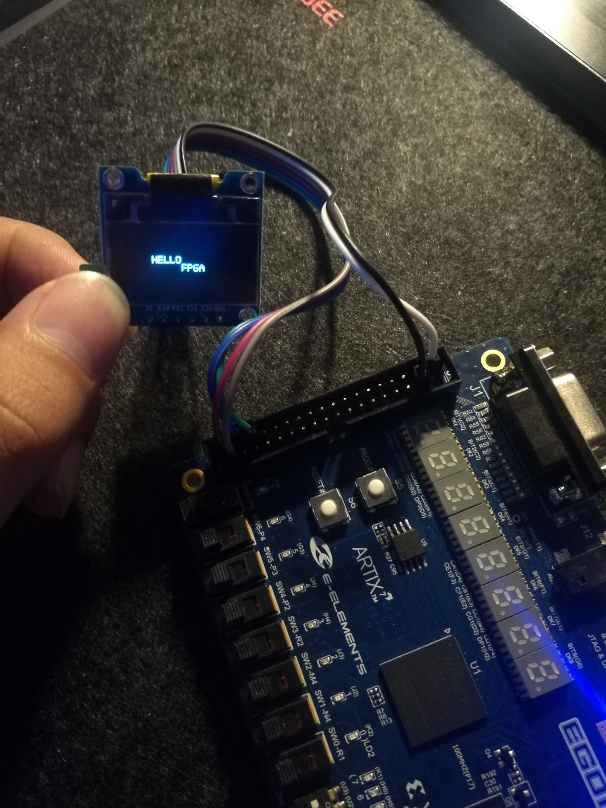

# HELLO_FPGA Project

## Information

- EDA：Vivado 2017.1
- language: Verilog
- FPGA板子：XILINX ARTIX-7 XC7A35TCSG324 EGO1
- 需要一块OLED板子，我的是：SSD1306 0.96寸128x64 蓝光OLED显示屏 4SPI
- 采用SPI协议
- 代码参考EGO1官网的OLED项目
- 代码均已注释

## 如何使用

- 直接在Vivado中，Add Source，分别添加.XDC和.V文件

## 如何观察

- 按照EGO1用户手册，将板子和OLED屏连接好
- 成功烧录程序后会在OLED屏上看到
