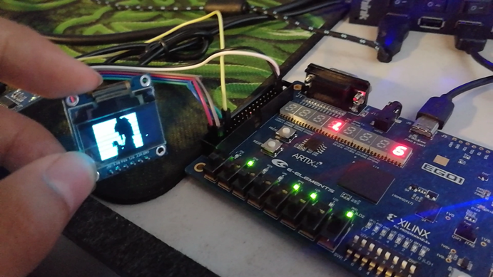
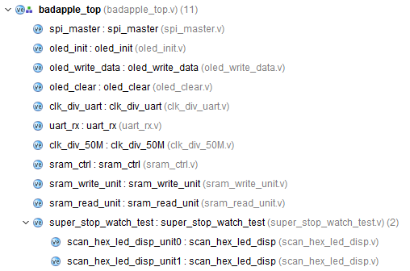

# FPGA实现Bad Apple

## 参考教程
[有屏幕的地方就有Bad Apple:0.96寸的屏幕播放Bad Apple](https://gezp.github.io/2017/09/25/%E6%9C%89%E5%B1%8F%E5%B9%95%E7%9A%84%E5%9C%B0%E6%96%B9%E5%B0%B1%E6%9C%89Bad-Apple0.96%E5%AF%B8%E7%9A%84%E5%B1%8F%E5%B9%95%E6%92%AD%E6%94%BEBad-Apple/)

## 实现的效果

OLED屏幕上播放视频


## 用到的硬件

- OLED SSD1306 0.96寸128x64 蓝光OLED显示屏 4SPI
- CH340G串口调试器模块
- FPGA Xilinx ARTIX-7 XC7A35TCSG324-1 EGO1

## 用到的软件

- Python
- MATLAB
- Vivado

## 代码文件

*具体代码详见[GitHub](https://github.com/IdlessChaye/FPGA/blob/master/badapple)*

### 图像处理

- vedioprocesser.py

### MATLAB串口通信发送数据
- opendatafile.m
- badapple.m

### FPGA缓存数据，OLED上输出图像

#### Verilog



#### xdc约束文件


## 实现的功能

1. PC端通过UART通信协议，实时发送处理过的视频数据到FPGA。
2. FPGA通过SRAM缓存数据。
3. PC端数据发送完毕，FPGA读SRAM。
4. FPGA把读到数据通过SPI通信协议，发送到OLED。

## 操作过程

1. 准备好所有硬件、软件和文件，下载好Bad Apple视频。
2. 用vedioprocesser.py处理视频文件，这里用到了opencv的库。py脚本和视频文件要放到一个文件夹，然后在命令行输入： ```python vedioprocesser.py``` 或者 ```py vedioprocesser.py``` 进行视频处理。这里做了两件事，一是对视频采样，采样出来的帧数没那么高，二是对采样的图像进行二值化以及分辨率处理，以适应OLED屏幕。视频处理完毕，在当前文件夹会生成默认叫做testtest.txt的文件。
3. 打开MATLAB，进入当前文件夹，运行opendatafile.m，将数据文件内的数据传送到MATLAB，以便通过UART发送。
4. 对FPGA板子供电，并烧录bit文件。
5. 连接OLED屏到FPGA上。
6. 运行badapple.m，MATLAB正往FPGA板子传数据。UART速率很慢，待PC端的数据都传完了，OLED屏上开始播放视频。通过对开关引脚的控制，可以暂停视频或者重新播放视频。
